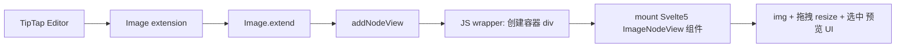

## 1. 思路是否正确？
你说的是：
> 在官方的 Image 节点的基础上扩展，不借助 `svelte-tiptap`，在 `addNodeView` 里用 Svelte 5 组件 + `mount` API 挂载，实现桥接。
这个方向是可行的，而且是比较“正统”的做法：
- 官方 Image 扩展本身就支持通过 `Image.extend` 自定义。
- `addNodeView` 就是专门用来“把一个节点渲染成自定义视图”的地方。
- Svelte 5 提供了命令式 API `mount`/`unmount`，可以不依赖 `svelte-tiptap` 直接在 JS 里挂载 Svelte 组件。
所以整体结构就是：

---
## 2. 官方 Image 扩展怎么“扩展”？
官方 `@tiptap/extension-image` 的源码显示：
- 它已经有 `src / alt / title / width / height` 这些属性。
- `addNodeView` 只在 `options.resize.enabled` 时才启用，并使用 `ResizableNodeView` 包装 ``。
所以你完全可以这样：
```ts
// custom-image-extension.ts
import { Image } from '@tiptap/extension-image'
import { ResizableNodeView } from '@tiptap/core'
import ImageNodeView from './ImageNodeView.svelte'
export const CustomImage = Image.extend({
  addNodeView() {
    return ({ editor, node, getPos, HTMLAttributes }) => {
      // 1. 创建一个容器，用来挂 Svelte 组件
      const container = document.createElement('div')
      // 2. 用 Svelte5 mount API 挂载你的组件
      const instance = mount(ImageNodeView, {
        target: container,
        props: {
          node,           // TipTap 节点
          editor,         // Editor 实例
          getPos,         // 获取位置的函数
          HTMLAttributes, // 合并后的属性（包含 src/alt/title 等）
        },
      })
      // 3. 返回 NodeView 描述对象
      return {
        dom: container,
        contentDOM: null, // Image 不需要编辑文本内容
        update: (updatedNode) => {
          // 当节点属性变化时，这里决定是否更新视图
          // 你可以在这里把 updatedNode.attrs 同步给 Svelte 组件
          // 目前可以先简单返回 false，让整个 NodeView 重建（性能略差但实现简单）
          return false
        },
        destroy: () => {
          // 卸载 Svelte 组件
          unmount(instance)
        },
      }
    }
  },
})
```
> 注意：Svelte 5 里 `mount` 返回的是组件实例，配套使用 `unmount` 卸载。
---
## 3. Svelte 5 组件怎么写？
在 `ImageNodeView.svelte` 里，你就可以完全用 Svelte 来写样式和交互：
```svelte
<script>
  import { unmount } from 'svelte'
  export let node
  export let editor
  export let getPos
  export let HTMLAttributes
  // 响应式属性（runes）
  let src = $derived(HTMLAttributes.src ?? node.attrs.src)
  let alt = $derived(HTMLAttributes.alt ?? node.attrs.alt)
  let title = $derived(HTMLAttributes.title ?? node.attrs.title)
  // 你的业务状态
  let selected = $state(false)
  let previewing = $state(false)
</script>
<div
  class="image-node"
  class:selected
  onclick={() => selected = !selected}
>
  
  {#if selected}
    <div class="toolbar">
      <button onclick={() => previewing = true}>预览</button>
      <button onclick={() => editor.chain().focus().deleteNode().run()}>
        删除
      </button>
    </div>
  {/if}
  {#if previewing}
    <div class="preview-modal" onclick={() => previewing = false}>
      
    </div>
  {/if}
</div>
```
这里有几个关键点：
- 所有样式、交互（选中、预览、工具条）都在 Svelte 里完成；
- 你可以根据 `node.attrs` / `HTMLAttributes` 做自己的布局；
- 如果需要“选中当前图片”，可以用 `editor.commands.setNodeSelection(getPos())` 等。
---
## 4. 调整大小：用官方 ResizableNodeView，还是自己做？
官方 Image 已经内置了 `ResizableNodeView`，不过只在 `resize.enabled` 时启用。你有两条路：
### 方案 A：继续用官方的 ResizableNodeView
如果你希望**尽可能复用官方行为**，可以在自定义 NodeView 里再包一层 `ResizableNodeView`：
```ts
addNodeView() {
  return ({ editor, node, getPos, HTMLAttributes }) => {
    const img = document.createElement('img')
    img.src = HTMLAttributes.src ?? node.attrs.src
    img.alt = HTMLAttributes.alt ?? node.attrs.alt ?? ''
    img.title = HTMLAttributes.title ?? node.attrs.title ?? ''
    const resizable = new ResizableNodeView({
      element: img,
      editor,
      node,
      getPos,
      onResize: (w, h) => {
        img.style.width = `${w}px`
        img.style.height = `${h}px`
      },
      onCommit: (w, h) => {
        const pos = getPos()
        if (pos === undefined) return
        editor
          .chain()
          .setNodeSelection(pos)
          .updateAttributes(node.type.name, { width: w, height: h })
          .run()
      },
      onUpdate: (updatedNode) => {
        if (updatedNode.type !== node.type) return false
        // 这里可以同步更新 img.src 等
        return true
      },
      options: {
        directions: ['bottom-right', 'bottom-left', 'top-right', 'top-left'],
        min: { width: 50, height: 50 },
        preserveAspectRatio: false,
      },
    })
    // 再外面包一层 Svelte 组件，用来做选中/预览等 UI
    const container = document.createElement('div')
    const instance = mount(ImageNodeView, {
      target: container,
      props: {
        node,
        editor,
        getPos,
        innerDom: resizable.dom, // 把 resizable 容器传给 Svelte 组件
      },
    })
    return {
      dom: container,
      contentDOM: null,
      update: () => false,
      destroy() {
        unmount(instance)
      },
    }
  }
}
```
在 `ImageNodeView.svelte` 里：
```svelte
<script>
  export let node
  export let editor
  export let getPos
  export let innerDom // ResizableNodeView 的容器
  let selected = $state(false)
</script>
<div class="image-wrapper" class:selected>
  <!-- 挂载 ResizableNodeView 的 DOM -->
  {#if innerDom}
    {@html innerDom.outerHTML}
  {/if}
  {#if selected}
    <div class="toolbar">...</div>
  {/if}
</div>
```
> 注意：这种“嵌套 DOM + Svelte”的做法要小心样式冲突，建议只在确实需要 ResizableNodeView 时再用。
### 方案 B：自己实现拖拽 / UI 调整
如果你想要更精细的控制（比如只有宽度拖拽、配合输入框调整尺寸、保持比例等），可以：
- 在 Svelte 组件里监听 `mousedown` / `touchstart`；
- 自己计算偏移，调用 `editor.commands.updateAttributes('image', { width, height })`；
- 完全不用 `ResizableNodeView`。
---
## 5. 关于“更新 props”的问题
`addNodeView` 返回的 NodeView 里有一个 `update` 回调：
```ts
update: (updatedNode) => {
  // 这里要决定：是否复用当前视图，还是让 TipTap 重建
  return true // 或 false
}
```
在 Svelte 5 里，**官方已经不再推荐用 `component.$set`**，而是：
- 要么让组件自己通过 props + runes 响应外部状态；
- 要么通过回调 / context 主动通知组件更新。
一个简单、实用的做法：
```ts
let latestNode = node // 记住当前节点
return {
  dom: container,
  contentDOM: null,
  update: (updatedNode) => {
    if (updatedNode.type !== node.type) return false
    // 1. 更新“最新节点引用”
    latestNode = updatedNode
    // 2. 通过组件暴露的方法通知更新（如果你在 Svelte 组件里导出了 updateNode）
    if (instance.updateNode) {
      instance.updateNode(updatedNode)
    }
    return true
  },
  destroy() {
    unmount(instance)
  },
}
```
在 Svelte 组件里：
```svelte
<script>
  export let node
  export let editor
  export let getPos
  // 内部维护一个响应式副本
  let myNode = $state(node)
  export function updateNode(newNode) {
    myNode = newNode
  }
</script>
<div>
  
</div>
```
这样就能在 NodeView `update` 里把最新的节点同步给 Svelte 组件。
---
## 6. 小结：你的理解哪里需要微调？
- ✅ “在官方 Image 基础上扩展” → 完全正确，用 `Image.extend` 即可。
- ✅ “不借助 svelte-tiptap，用 Svelte 5 + mount 桥接” → 可行，官方文档就是这样推荐命令式挂载的。
- ⚠️ 需要注意：
  - `addNodeView` 要返回一个符合 NodeView 接口的对象（`dom`, `contentDOM`, `update`, `destroy`）。
  - Svelte 5 不再使用 `$set`，而是通过 props / 回调 / 自己封装 `updateNode` 之类的方式来同步状态。
  - 如果要“调整大小”，官方已经有 `ResizableNodeView`，你可以选择在它外层再包 Svelte UI，也可以自己实现。
如果你愿意，我可以按你当前项目的目录结构，帮你写一份完整可跑的：
- `custom-image-extension.ts`
- `ImageNodeView.svelte`
- 以及如何在 Editor 里注册 `CustomImage` 的最小示例。
