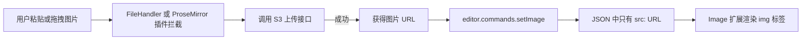

## 一句话结论
- 用 **Tiptap Image 扩展** 只负责“展示 URL 图片”，不负责上传。
- 用 **FileHandler 扩展 + 自定义粘贴/拖拽逻辑** 捕获图片文件，调用你的 S3 上传接口，拿到 URL 后插入 `image` 节点。
- 节点本身只存 `src`（URL），渲染时就是普通 ``。
---
## 整体流程示意

---
## 1. 技术选型：只改“输入”和“上传”，不改“存储结构”
Tiptap 官方已经把“上传”和“展示”拆得很清楚：
- **Image 扩展**：只负责把 `src` 渲染成 ``，不提供上传能力，默认也不处理文件粘贴。
- **FileHandler 扩展**：专门监听 `paste` / `drop` 文件事件，你可以自定义回调，把文件上传到服务器，然后插入对应节点。
你的需求：
> 粘贴时自动上传图床（S3 Compatible 存储），只存储 URL，展示时通过 URL 展示。
非常适合：
- Image 扩展保持不变（或只做属性扩展），只存 `src`。
- FileHandler 或自定义 ProseMirror 插件负责“上传 → 插入 URL”。
---
## 2. 核心实现思路
### 2.1 使用 Image 扩展（只存 URL）
```ts
// src/lib/extensions/CustomImage.ts
import Image from '@tiptap/extension-image'
export const CustomImage = Image.extend({
  // 如果你以后要加 width/height/alt 等属性，可以在这里扩展
  // addAttributes() {
  //   return {
  //     ...this.parent?.(),
  //     width: { default: null },
  //     height: { default: null },
  //   }
  // },
})
```
- Image 扩展默认就支持 `src`、`alt`、`title` 等属性，JSON 中只存这些字段。
- 你需要做的，是在“粘贴/拖拽图片”时，把 `src` 变成远程 URL，而不是 base64。
---
### 2.2 用 FileHandler 拦截粘贴/拖拽图片，并上传到 S3
**安装依赖：**
```bash
npm install @tiptap/extension-image @tiptap/extension-file-handler @tiptap/starter-kit @tiptap/core
```
**一个典型的 S3 上传函数（Svelte 5 中写在 lib 里）：**
```ts
// src/lib/upload/uploadToS3.ts
export async function uploadImageToS3(file: File, options: {
  endpoint: string     // 你的 S3 兼容服务地址，或后端代理接口
  bucket?: string
  region?: string
  headers?: Record<string, string>
}): Promise<string> {
  const formData = new FormData()
  formData.append('file', file)
  // 根据你的后端接口调整字段名
  formData.append('bucket', options.bucket ?? '')
  formData.append('region', options.region ?? '')
  const res = await fetch(options.endpoint, {
    method: 'POST',
    headers: options.headers,
    body: formData,
  })
  if (!res.ok) {
    throw new Error(`上传失败: ${res.status} ${res.statusText}`)
  }
  const data = await res.json()
  // 假设返回格式为 { url: 'https://s3.xxx/bucket/key' }
  if (!data.url) {
    throw new Error('上传接口未返回 url 字段')
  }
  return data.url
}
```
> 实际部署时，建议用后端签名 URL 或预签名接口，不要在前端暴露 AK/SK。
---
### 2.3 使用 FileHandler 扩展 + 上传逻辑
**示例：Tiptap 编辑器组件（Svelte 5 runes 写法）**
```svelte
<!-- src/lib/TiptapEditor.svelte -->
<script lang="ts">
  import { onMount, onDestroy } from 'svelte'
  import { Editor } from '@tiptap/core'
  import StarterKit from '@tiptap/starter-kit'
  import Image from '@tiptap/extension-image'
  import FileHandler from '@tiptap/extension-file-handler'
  import { uploadImageToS3 } from './upload/uploadToS3'
  let editorEl: HTMLElement
  let editor = $state<Editor | null>(null)
  const uploadConfig = {
    endpoint: '/api/upload-image', // 你的 S3 上传代理接口
    // bucket: '...',
    // region: '...',
  }
  onMount(() => {
    editor = new Editor({
      element: editorEl,
      extensions: [
        StarterKit,
        Image, // 这里可以换成上面 CustomImage
        FileHandler.configure({
          // 只允许粘贴/拖拽图片
          allowedMimeTypes: ['image/jpeg', 'image/png', 'image/gif', 'image/webp'],
          // 粘贴时的处理
          onPaste: (view, files, htmlContent) => {
            for (const file of files) {
              if (!file.type.startsWith('image/')) continue
              uploadImageToS3(file, uploadConfig)
                .then((url) => {
                  // 上传成功，插入图片节点
                  view.dispatch(
                    view.state.tr.replaceSelectionWith(
                      view.state.schema.nodes.image.create({ src: url }),
                    ),
                  )
                })
                .catch((err) => {
                  console.error('图片上传失败', err)
                  // 这里可以插入占位图或提示节点
                })
            }
          },
          // 拖拽时的处理
          onDrop: (view, files, pos) => {
            for (const file of files) {
              if (!file.type.startsWith('image/')) continue
              uploadImageToS3(file, uploadConfig)
                .then((url) => {
                  view.dispatch(
                    view.state.tr.insert(
                      pos,
                      view.state.schema.nodes.image.create({ src: url }),
                    ),
                  )
                })
                .catch((err) => {
                  console.error('图片上传失败', err)
                })
            }
          },
        }),
      ],
      content: '<p>粘贴或拖拽图片到这里试试</p>',
    })
  })
  onDestroy(() => {
    editor?.destroy()
  })
</script>
<div bind:this={editorEl} class="tiptap-editor"></div>
<style>
  .tiptap-editor {
    min-height: 200px;
    border: 1px solid #ccc;
    padding: 8px;
  }
</style>
```
这样：
- 用户粘贴 / 拖拽图片时，**FileHandler 拦截文件**。
- 文件被上传到你的 S3 兼容存储，返回 URL。
- 通过 `schema.nodes.image.create({ src: url })` 插入图片节点，**JSON 中只有 `src` 字段**。
---
## 3. 进阶：不用 FileHandler，直接写 ProseMirror 插件
如果你想要更细粒度控制（比如处理 HTML 粘贴中的 ``、防止重复插入等），可以直接在 Image 扩展上叠加一个 ProseMirror 插件，类似社区示例中的做法。
核心结构（伪代码，基于 Tiptap 官方讨论中的写法）：
```ts
// src/lib/extensions/CustomImageUpload.ts
import { Extension } from '@tiptap/core'
import { Plugin } from '@tiptap/pm/state'
import { uploadImageToS3 } from '../upload/uploadToS3'
export const ImageUploadExtension = Extension.create({
  name: 'imageUpload',
  addProseMirrorPlugins() {
    const uploadConfig = {
      endpoint: '/api/upload-image',
    }
    return [
      new Plugin({
        props: {
          handlePaste: (view, event) => {
            const items = event.clipboardData?.items
            if (!items) return false
            for (const item of items) {
              if (!item.type.startsWith('image/')) continue
              const file = item.getAsFile()
              if (!file) continue
              uploadImageToS3(file, uploadConfig)
                .then((url) => {
                  view.dispatch(
                    view.state.tr.replaceSelectionWith(
                      view.state.schema.nodes.image.create({ src: url }),
                    ),
                  )
                })
                .catch((err) => {
                  console.error('图片上传失败', err)
                })
              return true // 阻止默认粘贴行为
            }
            return false
          },
          // 如果需要，还可以加 handleDrop 拖拽逻辑
        },
      }),
    ]
  },
})
```
然后在 Editor 中：
```ts
extensions: [
  StarterKit,
  Image,
  ImageUploadExtension,
]
```
这个方案与 FileHandler 本质一样，只是你直接掌握插件逻辑，适合更复杂的粘贴策略。
---
## 4. 存储与展示：JSON 中只存 URL
最终编辑器 JSON 大致是：
```json
{
  "type": "doc",
  "content": [
    {
      "type": "paragraph",
      "content": [
        {
          "type": "image",
          "attrs": {
            "src": "https://your-s3-bucket.s3.amazonaws.com/path/to/image.jpg",
            "alt": null,
            "title": null
          }
        }
      ]
    }
  ]
}
```
- Tiptap 的 Image 扩展默认就按 `attrs.src` 渲染 ``。
- 你不需要在“展示”阶段再做任何特殊处理，只要保证 `src` 是完整 URL 即可。
---
## 5. Svelte 5 集成要点（与官方文档对齐）
官方 Svelte 集成示例中，已经展示了如何：
- 用 `onMount` 创建 Editor 实例。
- 用 `onDestroy` 销毁。
- 用 `bind:this` 绑定 DOM 容器。
你只需要在此基础上，把扩展数组换成上面包含 FileHandler / ImageUploadExtension 的版本即可。
---
## 6. 可以直接照抄的落地清单
1. 安装依赖  
   `@tiptap/core @tiptap/pm @tiptap/starter-kit @tiptap/extension-image @tiptap/extension-file-handler`
2. 实现 `uploadImageToS3(file, config)` 函数，对接你的 S3 兼容存储或后端接口。
3. 创建一个 Svelte 组件 `TiptapEditor.svelte`，按上面的示例：
   - 配置 `StarterKit + Image + FileHandler`。
   - 在 `onPaste` / `onDrop` 中调用 `uploadImageToS3`，拿到 URL 后插入 `image` 节点。
4. 如果需要更复杂的粘贴逻辑（例如过滤 HTML、防止重复图片），考虑自定义 `ImageUploadExtension`，用 ProseMirror 插件实现。
